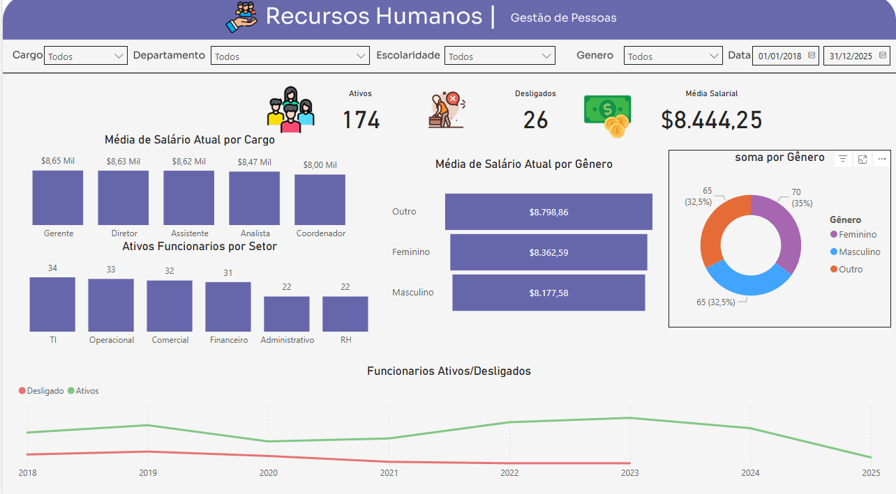

from zipfile import ZipFile
from pathlib import Path
from PIL import Image

# Caminhos dos arquivos
readme_content = """
# 📊 Dashboard de Recursos Humanos | Power BI

Este painel interativo foi desenvolvido com Power BI para análise de indicadores estratégicos de Recursos Humanos entre 2018 e 2025.

---

## 🎯 Objetivo

Oferecer uma visão clara sobre:

- Funcionários ativos e desligados  
- Média salarial por cargo, gênero e escolaridade  
- Distribuição de colaboradores por setor e faixa etária  
- Evolução do quadro de pessoal ao longo do tempo  
- Indicadores de diversidade (gênero e escolaridade)  
- Filtros interativos para análises segmentadas

---

## 📸 Visual do Dashboard

---

## 🧰 Tecnologias e Recursos Utilizados

- Power BI Desktop  
- Power Query  
- Linguagem DAX  
- Gráficos de colunas, donut, linhas e cartões  
- Filtros por data, cargo, departamento, escolaridade e gênero

---

## 📂 Dados

Os dados utilizados neste painel são **fictícios**, criados exclusivamente para fins educacionais e de demonstração de habilidades com Business Intelligence.

---

## 👤 Autor

**Emmanuel de Oliveira Perlata**  
[LinkedIn](https://www.linkedin.com/in/emmanuel-de-oliveira-peralta-b52bb6130/)

